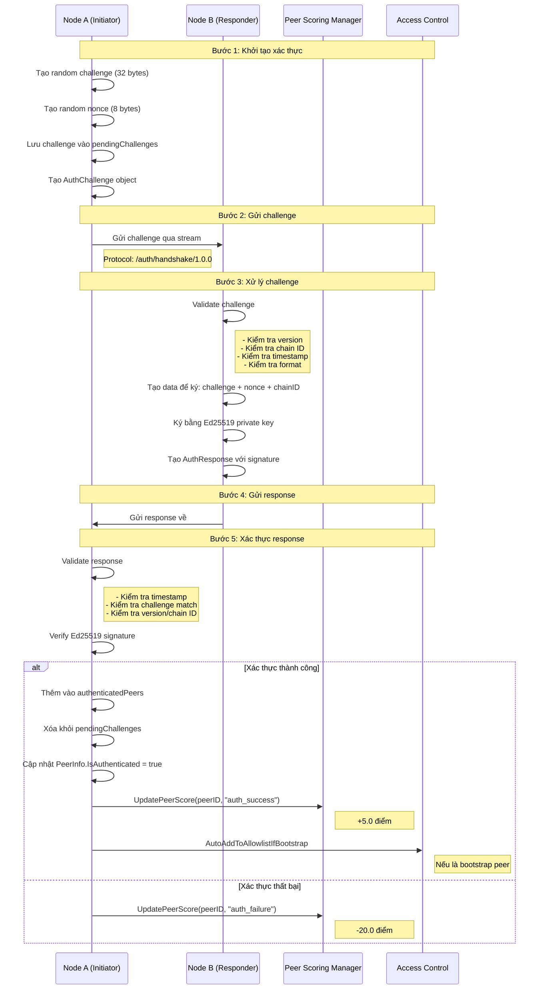
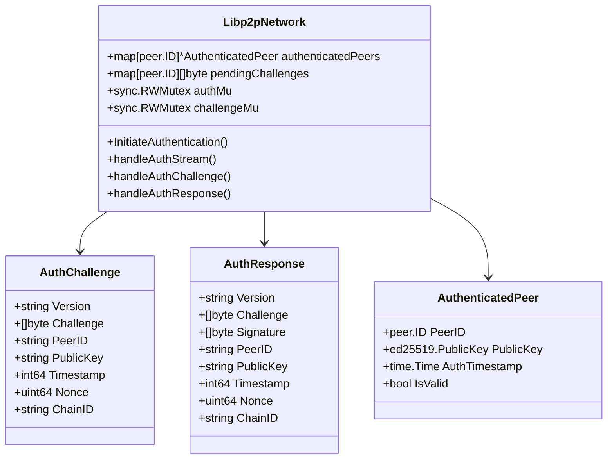
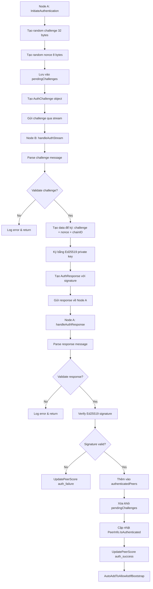
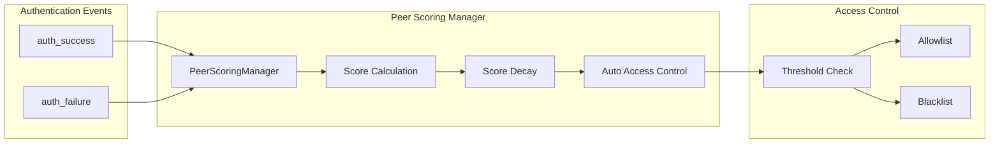
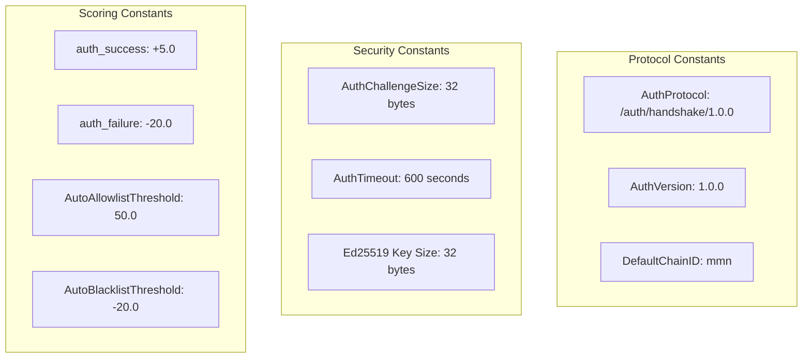
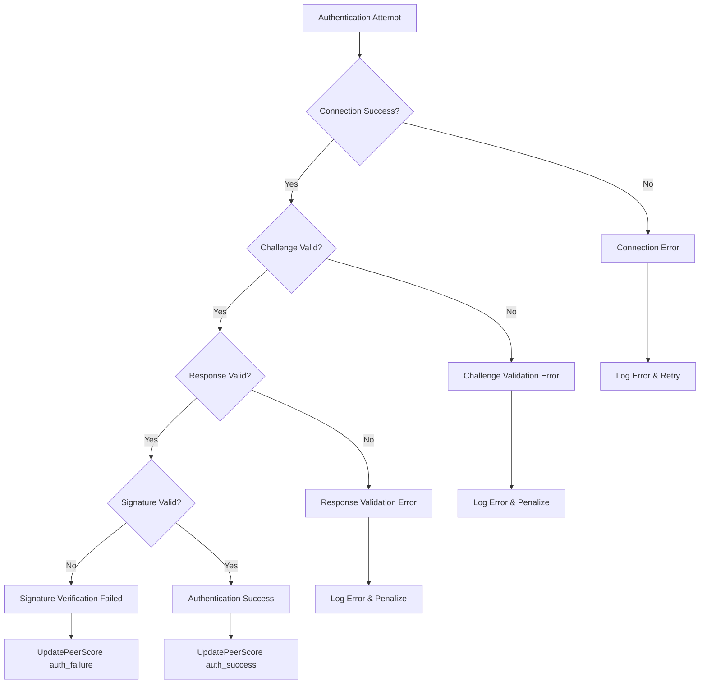

# Flow Xác Thực Node (Authentication Flow)

## Sơ Đồ Tổng Quan

## Sơ Đồ Chi Tiết Cấu Trúc Dữ Liệu

## Sơ Đồ Luồng Xử Lý Challenge

## Sơ Đồ Tích Hợp Với Peer Scoring

## Sơ Đồ Bảo Mật & Validation

```mermaid
flowchart TD
    subgraph "Challenge Validation"
        CV1[Version Check]
        CV2[Chain ID Check]
        CV3[Timestamp Check]
        CV4[Format Check]
    end
    
    subgraph "Response Validation"
        RV1[Timestamp Check]
        RV2[Challenge Match]
        RV3[Version Check]
        RV4[Signature Verify]
    end
    
    subgraph "Security Measures"
        SM1[Ed25519 Cryptography]
        SM2[Random Challenge]
        SM3[Random Nonce]
        SM4[Timeout Protection]
        SM5[Replay Attack Prevention]
    end
    
    CV1 --> CV2 --> CV3 --> CV4
    RV1 --> RV2 --> RV3 --> RV4
    SM1 --> SM2 --> SM3 --> SM4 --> SM5
```

## Constants & Configuration

## Error Handling Flow

